# Intro

As part of this series of blog posts, I want to implement a modern data lake using self-hosted technologies. Over the next few posts, I will explain the architecture and guide you through each component of the data pipeline.

## Architecture

The diagram below makes use of the following tech stack:

<TechStack technologies={["Docker", "Minio", "PostgreSQL",
     "MlFlow", "GraphQL", "gRPC",
     "Prometheus", "Grafana", "Rust", "Python"]}
/>

The data will be produced using fake data generators. While I may consider scraping data from OpenWeather in the future, for the first version, I will generate synthetic data.
To organize the data, I will follow the **Medallion Architecture**.

  Medallion architecture is a pattern used to logically organize data and improve its structure and quality as the data flows through each layer. It consists of three main layers:
    - **Bronze**: Raw data
    - **Silver**: Cleaned data
    - **Gold**: Aggregated data ready to be used in production

### Data storage
The data will be structured in the following platforms:
- Minio: Bronze data
- PostgreSQL: Silver and Gold layers

### Data processing
The data in the Bronze The data in the Bronze layer (raw) will be processed using **Polars** to clean and transform it.
 The cleaned data will be stored in PostgreSQL in the **Silver** layer.
The **Gold** layer will contain aggregated data, ready for use in production systems or for machine learning tasks.

### Machine Learning
A service will consume gold layer and will implement a Machine Learning model that will be stored in MLFlow
to keep track of the experiments created.

### Data access layer
The data will be served through two endpoints:
- **GraphQL**: A public endpoint to query the Gold layer.
- **gRPC**: An internal communication service for real-time interactions with machine learning models.

```mermaid
graph TD;

  %% Data Ingestion
  A[External Data Sources] -->|Events| B[🐇 RabbitMQ];
  B -->|Raw Data| C[🗄️ MinIO Bronze Layer];

  %% Data Processing
  C -->|ETL with Polars| D[🛢️ PostgreSQL Silver Layer];
  D -->|Transformations| E[📊 PostgreSQL Gold Layer];

  %% Machine Learning
  E -->|Training Data| F[🤖 ML Model Training];
  F -->|Metrics & Artifacts| G[📜 MLflow Tracking];
  F -->|Register Model| H[🏛️ MLflow Model Registry];

  %% APIs
  E -->|Query Data| I[🌐 GraphQL API];
  H -->|Load Model| J[⚡ gRPC Inference Service];

  %% Monitoring
  I -->|Metrics| K[📈 Prometheus + Grafana];
  J -->|Metrics| K;

  %% Feedback Loop
  J -->|Predictions| E;

```

## Outro

In the upcoming posts I will dive deeper into each component and explain the difficulties and choices made during the process.