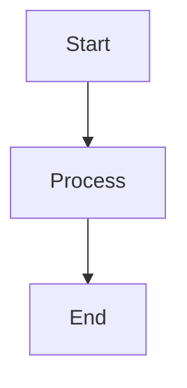

# Hello there

I moved out from Hugo to NextJS. Now I just need to start writing stuff


```typescript
import yaml from "js-yaml";
import { promises as fs } from "node:fs";
import path from "node:path";

interface Resume {
	personal: {
		name: string;
		title: string;
		nationality: string;
		email: string;
		location: string;
		summary: string;
	};
	experience: {
		company: string;
		position: string;
		location: string;
		startDate: string;
		endDate: string;
		highlights: string[];
	}[];
	education: {
		institution: string;
		degree: string;
		location: string;
		startDate: string;
		endDate: string;
	}[];
	skills: {
		[category: string]: string[];
	};
	languages: {
		name: string;
		level: string;
	}[];
	certifications?: {
		name: string;
		issuer: string;
		date: string;
	}[];
}

export async function getResumeData(): Promise<Resume> {
	const resumeFile = path.join(process.cwd(), "data", "resume.yaml");
	const resumeYaml = await fs.readFile(resumeFile, "utf8");
	return yaml.load(resumeYaml) as Resume;
}
```


