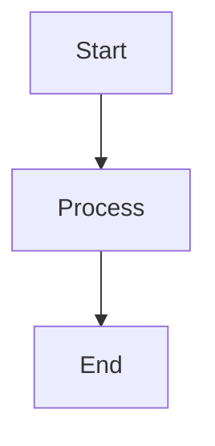

# Hello there

I moved out from Hugo to NextJS. Now I just need to start writing stuff

<Image
  src="/images/blog/example.png"
  alt="Example image"
  width={125}
  height={630}
/>

```typescript
import yaml from 'js-yaml';
import { promises as fs } from 'node:fs';
import path from 'node:path';

interface Resume {
  personal: {
    name: string;
    title: string;
    nationality: string;
    email: string;
    location: string;
    summary: string;
  };
  experience: {
    company: string;
    position: string;
    location: string;
    startDate: string;
    endDate: string;
    highlights: string[];
  }[];
  education: {
    institution: string;
    degree: string;
    location: string;
    startDate: string;
    endDate: string;
  }[];
  skills: {
    [category: string]: string[];
  };
  languages: {
    name: string;
    level: string;
  }[];
  certifications?: {
    name: string;
    issuer: string;
    date: string;
  }[];
}

export async function getResumeData(): Promise<Resume> {
  const resumeFile = path.join(process.cwd(), 'data', 'resume.yaml');
  const resumeYaml = await fs.readFile(resumeFile, 'utf8');
  return yaml.load(resumeYaml) as Resume;
}
```



<Callout type="info">This is an important information block.</Callout>

<Details summary="Click to expand">
  Hidden content that can be expanded.
</Details>

<Terminal
  commands={[
    {
      command: "npm install next",
      output: "Installing dependencies...",
      timing: "2.3s"
    },
    {
      command: "rm -rf /",
      output: "Permission denied",
      error: true
    },
    {
      command: "npm run build",
      loading: true
    }
  ]}
  shell="bash"
/>
<Terminal
  commands={[
    { command: "npm install next" },
    { command: "npm run dev" }
  ]}
  shell="bash"
/>


<TechStack technologies={["React", "Next.js", "TypeScript"]} />

<Steps>
  <div>First step explanation</div>
  <div>Second step details</div>
  <div>Final step implementation</div>
</Steps>


<Details summary="Click to expand">
  This content is hidden by default.
  You can put any MDX content here:
  - Lists
  - Code blocks
  - Other components
</Details>

<Details summary="Technical Details">
  ```typescript
  function example() {
    console.log('Hello from Details!');
  }
  ```
</Details>